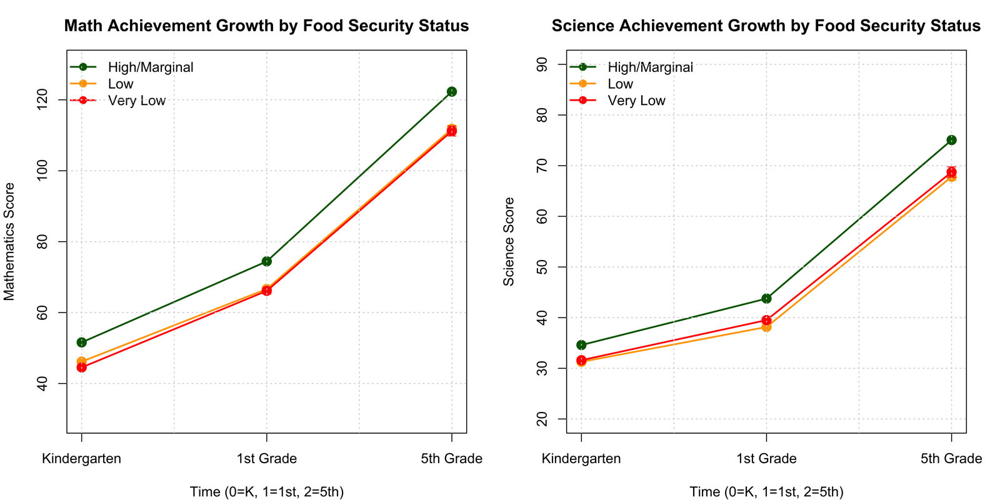

> You can access our final [*report*](FoodInsecurity_GEE_Report.pdf) and [*presentation*](FoodInsecurity_GEE_Presentation.pdf) here. :)

For my final project in BIOSTAT 653 (Applied Longitudinal Analysis), we examined how changes in household food security from kindergarten through 5th grade predict children's mathematics and science achievement, using data from the Early Childhood Longitudinal Study, Kindergarten Class of 2010-11 (ECLS-K:2011). I modeled population-averaged effects of food security on child outcomes over three waves (Spring Kindergarten, Spring 1st Grade, and Spring 5th Grade) using GEE with robust standard errors, adjusting for a comprehensive set of confounders including race, disability status, household size, and urbanicity.

```{r, echo=FALSE, fig.align='center', out.width='100%', fig.cap="Math and Science Achievement Growth by Food Security Status"}

```

Children in more food-secure households showed consistently higher math and science achievement across all three waves, with the gap widening as children progressed from kindergarten to 5th grade. I also tested whether family socioeconomic status moderated this relationship and ran a series of sensitivity analyses, including alternative correlation structures, a categorical food-security specification, and a complete-case comparison, to confirm the robustness of these findings.